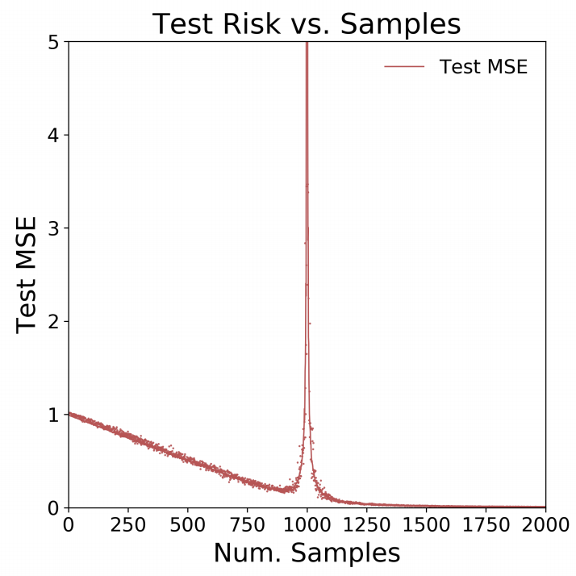

```{r setup, include=FALSE}
knitr::opts_chunk$set(echo = T, warning = F, message = F, cache = F)
set.seed(1)
options(scipen = 999)

if (!require("pacman")) install.packages("pacman")
pacman::p_load(char = c(
  "MASS"
))
```

<br>

## Motivation

On my last [blog post](https://iyarlin.github.io/2021/03/09/sparse_matrix_representation_for_ml_in_scale/)
I've discussed a scalable sparse linear regression model I've developed at work. 
One of it's interesting properties that it's an interpolating model - meaning 
it has 0-training error. This is because it has many many more columns than it has 
rows.

While 0-training error is usually associated with over-fiting, the model seems to
be pretty solid on the test set as well. Reports of hugely over-parameterized 
models that seem to not suffer from overfiting have been accmulating in recent
years and so the literature on subject. See this great [Medium post](https://towardsdatascience.com/something-every-data-scientist-should-know-but-probably-doesnt-the-bias-variance-trade-off-25d97a17329d) if you'd like to learn more.

One of the interesting papers on the subject is: "More Data Can Hurt for Linear 
Regression: Sample-wise Double Descent" by Preetum Nakkiran. It presents a rather 
counter-intuitive result: In some situations having more samples can actually 
reduce prediction accuracy! 

I'll try to briefly summarize the problem setup: Let's assume we have a data 
generating process of the form of a linear regression with 1000 covariates (no 
intercept). We'd like to simulate test set MSE as a function of the number of 
samples in our dataset.

In cases where Num. Samples $\geq 1000$ we fit a regular regression. In cases
where Num. Samples is smaller than 1000 there's no closed form solution.
Since there are more covariates than samples there exist infinite solutions! 
We can find a minimum norm L2 solution using the Moore-Penrose generalized 
inverse of a matrix X implemented in the MASS package.

Below we can see the simulation results from the paper - we can see that 
somewhere around Num. Samples = 900 the test error actually goes up as the number
of samples increases towards 1000:

```{r echo=FALSE, fig.cap="Original paper result figure", fig.width=3, fig.height=3}

```

I decided I had to see that for myself, hence in this post I'll reproduce the
paper results.

## Results reproduction

First we setup the simulation paramters:

```{r setup simulation parameters}
beta <- runif(1000) # real betas
beta <- beta/sqrt(sum(beta^2)) ## ensure that the norm equals 1
M <- 50 ## number of simulations
N <- c(2, seq(100, 800, 100), seq(900, 990, 10), seq(991,1000,1), 
       seq(1001, 1009, 1), seq(1010, 1100, 10), seq(1200, 2000, 100)) ## number of observations
test_MSE <- matrix(nrow = length(N), ncol = M)
```

Below we perform the actual simulation:

```{r, eval=F}
for (i in 1:length(N)){
  for (m in 1:M){
    print(paste0("n=", N[i], ", m=", m))
    X <- replicate(1000, rnorm(N[i]))
    e <- rnorm(N[i], sd = 0.1)
    y <- X %*% beta + e
    
    if (N[i] < 1000){
      beta_hat <- ginv(X) %*% y
    } else {
      dat <- as.data.frame(cbind(y, X))
      names(dat)[1] <- "y"
      lm_model <- lm(y ~ .-1, data = dat)
      beta_hat <- matrix(lm_model$coefficients, ncol = 1)
    }
    
    X_test <- replicate(1000, rnorm(10000))
    e_test <- rnorm(10000, sd = 0.1)
    y_test <- X_test %*% beta + e_test
    
    preds_test <- X_test %*% beta_hat
    test_MSE[i, m] <- sqrt(mean((y_test - preds_test)^2))
  }
}
```

Since running time is pretty long it's useful to save results for later use:

```{r, eval=F}
saveRDS(test_MSE, "../simulation_results.rds")
```

Let's plot the results:

```{r}
test_MSE <- readRDS("../simulation_results.rds")
matplot(N, test_MSE, type = "p", pch = ".", ylim = c(0,5), 
        xaxt = "n", xlim = c(0,2000), ylab = "Test MSE", xlab = "Num. Samples")
axis(1, at = seq(0,2000,250))
lines(N, apply(test_MSE, 1, mean), col = "red")
```

Amazingly enough - we got the exact same results!