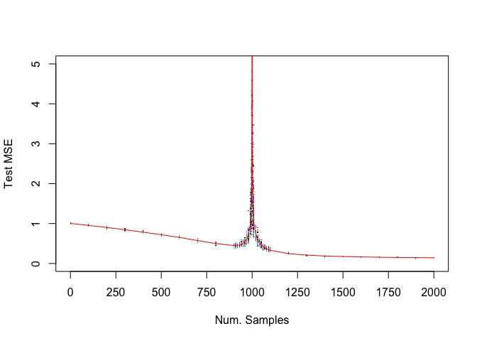

Paper results re-production: More Data Can Hurt for Linear Regression:
Sample-wise Double Descent
================
Iyar Lin
08 May, 2021

-   [Motivation](#motivation)
-   [Results reproduction](#results-reproduction)

<br>

## Motivation

On a recent [blog
post](https://iyarlin.github.io/2021/03/09/sparse_matrix_representation_for_ml_in_scale/)
I’ve discussed a scalable sparse linear regression model I’ve developed
at work. One of it’s interesting properties is that it’s an
interpolating model - meaning it has 0-training error. This is because
it has more columns than it has rows.

While 0-training error is usually associated with over-fiting, the model
seems to be perform pretty well on the test set. Reports of hugely
over-parameterized models that seem to not suffer from overfiting have
been accmulating in recent years and so the literature on subject. This
[Medium
post](https://towardsdatascience.com/something-every-data-scientist-should-know-but-probably-doesnt-the-bias-variance-trade-off-25d97a17329d)
gives a great introduction to this topic.

One of the interesting papers on the subject is: [“More Data Can Hurt
for Linear Regression: Sample-wise Double
Descent”](https://arxiv.org/pdf/1912.07242.pdf) by Preetum Nakkiran. It
presents a rather counter-intuitive result: In some situations having
more samples can actually reduce prediction accuracy!

I’ll try to briefly summarize the problem setup: Let’s assume we have
our data is generated from a linear model with 1000 covariates (without
intercept). For every sample size
 we fit a linear
regression and measure the MSE on a hold out test set.

In cases where

we fit a regular regression. In cases where
 we
have  and
there’s no closed form solution since the inverse of the design matrix
does not exist.

The equation

has infinte solutions in this case. Of those solutions, the solution
which minimizes the coefficient L2 norm

has the lowest variance and thus should have the best performance on the
test set. We can find the minimum norm L2 solution using the
Moore-Penrose generalized inverse of a matrix X implemented in the MASS
package.

Below we can see the simulation results from the paper: we can see that
somewhere around Num. Samples = 900 the test error actually goes up as
the number of samples increases towards 1000:

<div class="figure">


<p class="caption">
Original paper result figure
</p>

</div>

I decided I had to see that for myself, hence in this post I’ll
reproduce the paper results.

## Results reproduction

First we setup the simulation paramters:

``` r
beta <- runif(1000) # real coefficients
beta <- beta/sqrt(sum(beta^2)) ## ensure that the norm equals 1
M <- 50 ## number of simulations
N <- c(2, seq(100, 800, 100), seq(900, 990, 10), seq(991,1000,1), 
       seq(1001, 1009, 1), seq(1010, 1100, 10), seq(1200, 2000, 100)) ## number of observations
test_MSE <- matrix(nrow = length(N), ncol = M)
```

Below we perform the actual simulation:

``` r
for (i in 1:length(N)){
  for (m in 1:M){
    print(paste0("n=", N[i], ", m=", m))
    X <- replicate(1000, rnorm(N[i]))
    e <- rnorm(N[i], sd = 0.1)
    y <- X %*% beta + e
    
    if (N[i] < 1000){
      beta_hat <- ginv(X) %*% y
    } else {
      dat <- as.data.frame(cbind(y, X))
      names(dat)[1] <- "y"
      lm_model <- lm(y ~ .-1, data = dat)
      beta_hat <- matrix(lm_model$coefficients, ncol = 1)
    }
    
    X_test <- replicate(1000, rnorm(10000))
    e_test <- rnorm(10000, sd = 0.1)
    y_test <- X_test %*% beta + e_test
    
    preds_test <- X_test %*% beta_hat
    test_MSE[i, m] <- sqrt(mean((y_test - preds_test)^2))
  }
}
```

Let’s plot the results:

``` r
matplot(N, test_MSE, type = "p", pch = ".", ylim = c(0,5), 
        xaxt = "n", xlim = c(0,2000), ylab = "Test MSE", xlab = "Num. Samples")
axis(1, at = seq(0,2000,250))
lines(N, apply(test_MSE, 1, mean), col = "red")
```

<!-- -->

Amazingly enough - we got the exact same results!
